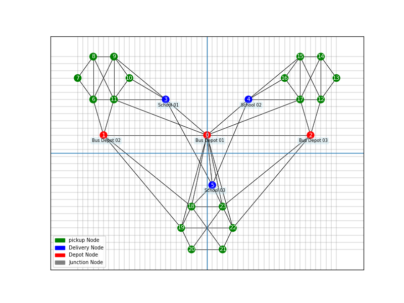

# Vehicle Routing Problem with Time Window Constraints(VRPPDTW)

## Description
This project is a Python-based solver for the Vehicle Routing Problem with time window constraints (VRPPDTW) using the DOcplex solver. It allows users to optimize routes for vehicles to efficiently deliver people within a network while respecting pickup and delivery time windows.
The code uses graph layout including nodes and edges and requests and vehicles information to solve the problem and output a comprehensive output of each service bus's information. Each bus has total travel time, total travel distance, total cost, and a list of movements. Each movement is comprised of the following data:
- `origin_dest_ids`: A list containing the origin and destination node IDs.
- `start_time`: The start time of the movement.
- `finish_time`: The finish time of the movement.
- `start_load`: The load of the vehicle at the start of the movement.
- `finish_load`: The load of the vehicle at the end of the movement.
- `request_id`: The ID of the request associated with the movement (if applicable).
- `path`: The sequence of nodes visited during the movement.
- `path_cost`: The cost associated with traversing the path.
- `travel_time`: The total travel time for the movement.
- `travel_distance`: The total travel distance for the movement.
- `status`: The status of the movement, indicating whether it involves picking up or delivering a request.

Here's an example of the output movements:

```json
{
    "origin_dest_ids": [
        10,
        0
    ],
    "start_time": "0:0",
    "finish_time": "6:0",
    "start_load": 0,
    "finish_load": 3,
    "request_id": 0,
    "path": [
        7,
        4,
        5,
        8,
        11,
        10,
        0
    ],
    "path_cost": 18.7,
    "travel_time": 15.5,
    "travel_distance": 8.8,
    "status": "Picking Up Request 0 at Node 0"
}
```

## Installation

To use this project, you need to have Python installed on your system. You can download Python from the [official Python website](https://www.python.org/downloads/).

Once you have Python installed, you can install the required dependencies using pip. Run the following command in your terminal or command prompt:

```bash
pip install -r requirements.txt
```

## Usage
1. Run the main function within the `VRPPDTW.py` file. As the input, enter the folder name of one of the samples(For example 2). Each folder contains 4 csv files as the input data. Running the code will output 4 json files for chosen l_ik, t_ik, x_ijk and finally trips which includes all the information necessary. You could also create and test you own examples by placing them inside the `Samples` directory
2. Use `Plot_Graph.py` for plotting the graph layout along with request pickups, deliveries, and depots, like the image below:


<div style="text-align:center;margin-top:2rem;margin-bottom:2rem">

</div>


3. You could also use `Plot_Graph.py` for plotting the solution, either the overall or the step by step. Use <b>Spacebar</b> to go to next step and <b>q</b> to exit:

<div style="align-items:center;display:flex;justify-content:center;gap:2rem;margin-top:2rem;margin-bottom:2rem">


</div>

4. You can also create a Gifs using the same file. Both the step by step solutions and the Gifs display the current status of each movement, load of the bus at the beginning and the end, the start and finish time of the movement and path and total cost in the image.
You can use space bar to move to the next movement or press q to exit

<div style="align-items:center;display:flex;justify-content:center;gap:2rem;margin-top:2rem;margin-bottom:2rem">

</div>

## Examples
To see examples of how the VRPWT solver can be used, check out the `Solution` within each of the samples.

## Contact
For questions or feedback, please email [danialchekani@arizona.edu](mailto:danialchekani@arizona.edu) or [danialchekani2000@gmail.com](danialchekani2000@gmail.com)

## Contributions
- Dr. Choobchian: Provided guidance in locating the pertinent research paper, comprehending the underlying problem, and contributing to the implementation.
- Dr. Mohammadi: Designed sample data and assisted with the implementation process.
- Dr. Shamshiripour: Contributed to the implementation and offered additional insights.

## Acknowledgements

This project is an implementation of the paper titled "VRP with Pickup and Delivery" by Desaulniers, G., Desrosiers, J., Erdmann, A., Solomon, M.M., & Soumis, F. (2002). The paper addresses the Vehicle Routing Problem with Pickup and Delivery (VRPPD) and provides insights into solving it efficiently.

If you find this project useful in your research or work, consider citing the paper


